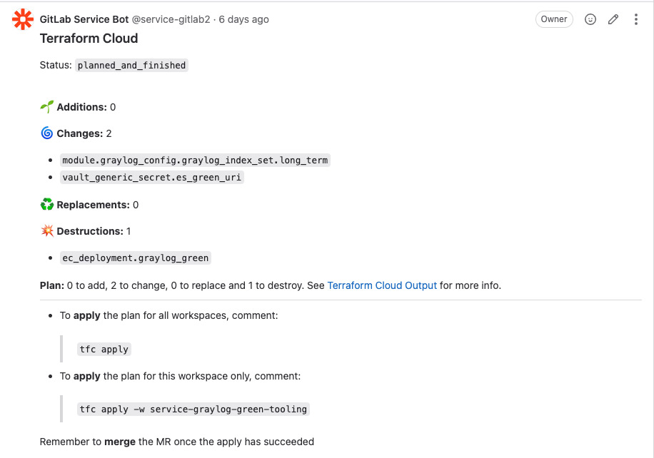
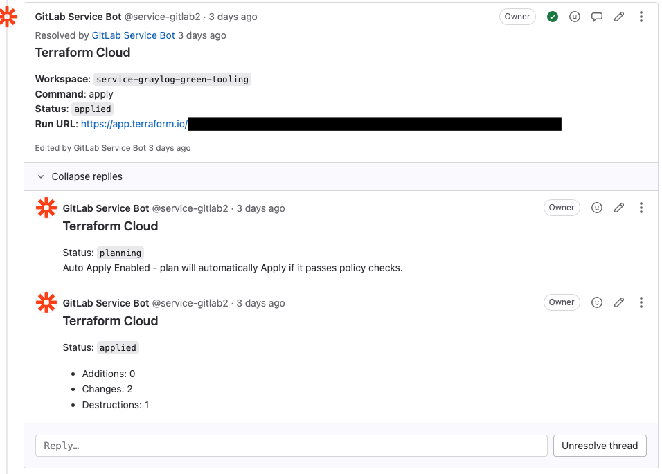

# Architecture

TF Buddy is driven by different webhook events from either a Terraform Cloud workspace, or a supported VCS (Github/Gitlab). These events are either user commands in the form of comments, or changes in state (PR being opened/closed).

## Overview


Once you have TF Buddy deployed you need to register a webhook from each repo that you want TF Buddy to operate on. You also need to register a webhook from each Terraform Workspace that you want TF Buddy to interact with. Once that's configured TF buddy will kick into action when you open a new PR. TF Buddy will then execute a speculative plan against the branch and will report back the plan in a detailed manner.



If you're happy with the plan you can issue a apply command `tfc apply` or if you're operating on multiple workspaces you can target a specific workspace `tfc apply -w workspace_name`. TF Buddy will verify that the PR is approved if that's required on your repo. It will also reject any applies if the branch has conflicts. Once the apply starts TF Buddy will provide a link to the run in Terraform Cloud for you to follow along with.



Once the apply completes TF Buddy will update the PR indicating what was changed and if there was any errors.

Example of how an error is reported


A more detailed error message is provided if the error occurred within TF Buddy. If the error occurred during terraform plan or terraform apply it will not contain a detailed message. Instead the run link will take you to the Terraform workspace where you can debug the error.


### Webhook Management

At Zapier we automate the creation of all relevant webhooks by leveraging Terraform to create them. The example below is a resource we use to hook up a Gitlab project and a Terraform Cloud workspace to TF Buddy.

```terraform
resource "gitlab_project_hook" "tfbuddy" {

  project = "project"
  url     = var.tfbuddy_gitlab_webhook_url

  enable_ssl_verification = true

  merge_requests_events = true
  note_events           = true
  push_events           = true

  token = var.tfbuddy_gitlab_webhook_token
}

resource "tfe_notification_configuration" "tfbuddy" {

  name             = "tfbuddy"
  enabled          = true
  destination_type = "generic"
  triggers = [
    "run:created",
    "run:planning",
    "run:errored",
    "run:needs_attention",
    "run:applying",
    "run:completed"
  ]
  url          = var.tfbuddy_tfc_webhook_url
  workspace_id = "workspace_id"
}

```

